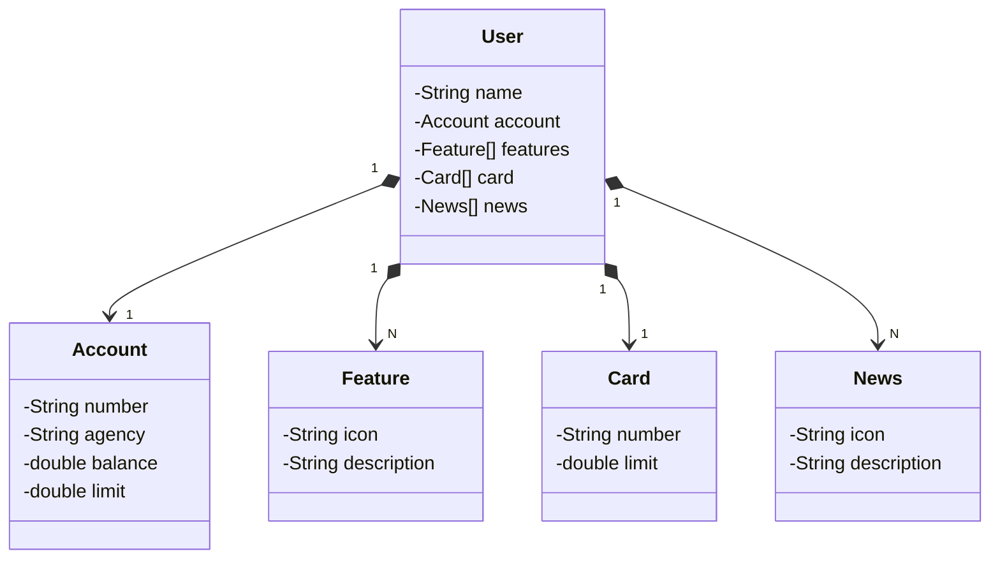

## Projeto Rest para aprender a publicar API na nuvem
<ul>
  <li>Spring Boot 3</li>
  <li>Java 17</li>
  <li>Railway</li>
  <li>H2 database</li>
  <li>PostgresSQL</li>
  <li>Gradle</li>
</ul>

## Diagrama de classes

